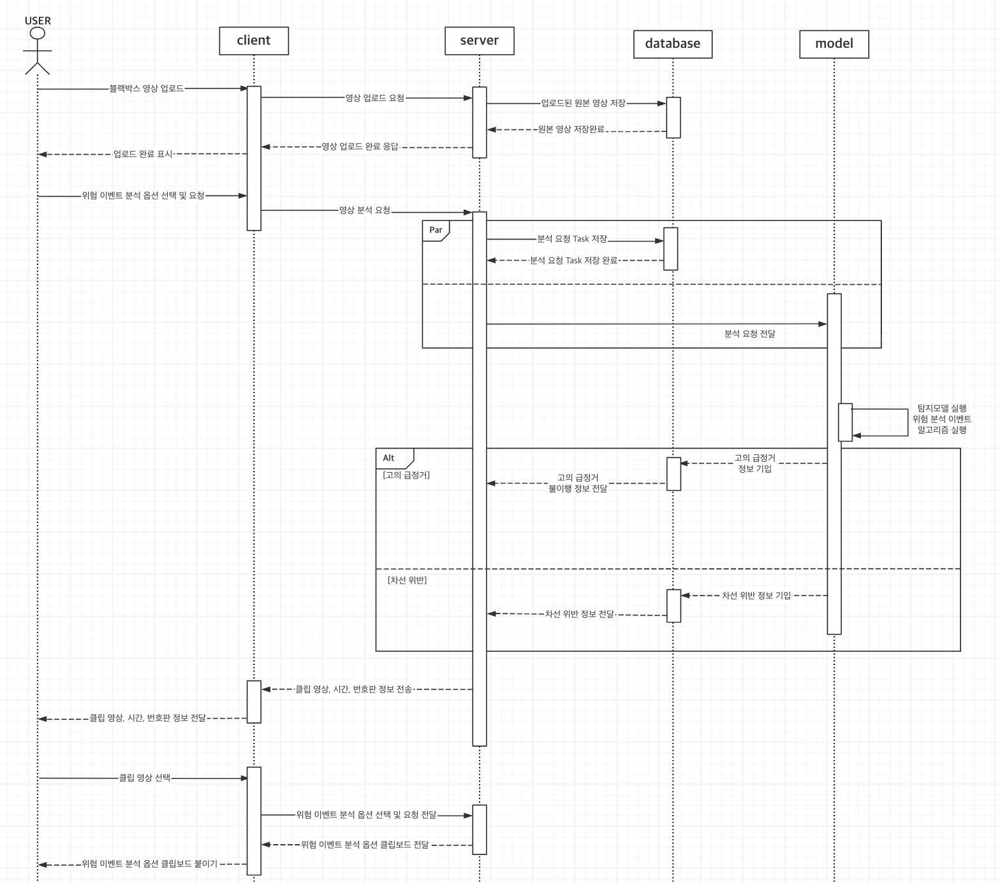

# Black Duck (Final Aggregation Repo)

이 레포지토리는 웹(Web)과 모델(Model) 서브모듈을 모아 둔 최종 통합 레포입니다. 실행 및 상세 구현은 각 서브모듈의 문서를 기준으로 합니다.

## 1. 프로젝트 설명
- Black Ori는 블랙박스 영상에서 교통 위험 이벤트를 자동으로 탐지하고 신고에 필요한 정보만 정리해주는 웹 서비스입니다.
- 실제 개발 및 배포 문서는 각 서브모듈 README를 참고

### 1.1. 문제인식
> 교통 위반을 신고하는 과정은 블랙박스 영상 확인, 구간 편집, 용량 조정 등 사용자의 수작업에 크게 의존하고 있습니다. 이러한 과정은 사용자에게 불필요한 시간과 노력을 요구합니다.

### 1.2. 프로젝트 목표 & 기대효과
> Black Ori는 사용자가 영상 하나만 업로드하면 위험 이벤트 탐지부터 신고에 필요한 정보 정리까지 한 번에 완료할 수 있는 경험을 제공하는 것을 목표로 합니다.
>
> 이를 통해 교통 위반 신고 과정의 부담을 줄이고, 보다 효율적이고 직관적인 신고 환경을 제시하고자 합니다.

## 2. 서비스 흐름도

### 2.1 Service Architecture

### 2.2 UML Sequence Diagram

## 3. 서브모듈 상세 문서
- Web: `./black-duck-web` (상세: `./black-duck-web/README.md`)
    - [BlackOri-Web](https://github.com/CV-11-boostcamp-ai-tech-8th/black-duck-web)
- Model: `./black-duck-model` (상세: `./black-duck-model/README.md`)
    - [BlackOri-Model](https://github.com/CV-11-boostcamp-ai-tech-8th/black-duck-model)

## 4. 팀원 역할
<table>
  <colgroup>
    <col style="width: 20%" />
    <col style="width: 20%" />
    <col style="width: 60%" />
  </colgroup>
  <thead>
    <tr>
      <th>이름</th>
      <th>역할</th>
      <th>담당 업무 요약</th>
    </tr>
  </thead>
  <tbody>
    <tr>
      <td>T8012 고형석</td>
      <td>[역할1]</td>
      <td>[담당 업무 요약1]</td>
    </tr>
    <tr>
      <td>T8028 김민진</td>
      <td>[역할2]</td>
      <td>[담당 업무 요약2]</td>
    </tr>
    <tr>
      <td>T8065 류제윤</td>
      <td>[역할3]</td>
      <td>[담당 업무 요약3]</td>
    </tr>
    <tr>
      <td>T8155 이승재</td>
      <td>Project Leading (PM)</td>
      <td>Full Stack Engineering, Async Task, Docker</td>
    </tr>
    <tr>
      <td>T8199 주상우</td>
      <td>[역할5]</td>
      <td>[담당 업무 요약5]</td>
    </tr>
  </tbody>
</table>

## 5. 발표 자료 및 보고서
- PPT: [Canva]()
- 랩업 리포트: [Notion]()
