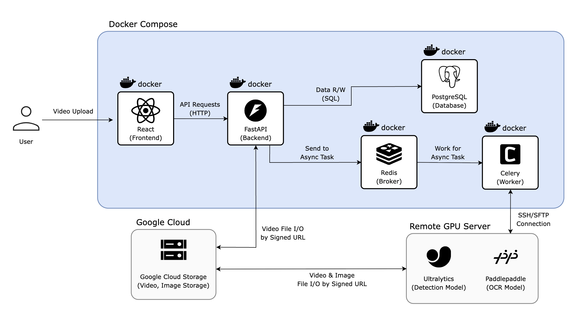

  <h2>🦆 Black Ori 🦆   블랙박스 영상기반 교통법규 위반 자동 탐지 시스템</h2>

  

    
  

## 📌 Project Overview
> Black Ori는 블랙박스 영상을 기반으로 교통 법규 위반 이벤트를 자동 탐지하고 신고에 필요한 정보를 구조화된 리포트로 생성하는 Vision AI 기반 웹 서비스입니다.
>
> **Program Information** : NAVER Boostcamp AI Tech 8th (CV Domain) Final Team Project
> 
> **Duration** : `2026.01.07` ~ `2026.02.09`

### 1️⃣ Problem Recognition
세상에는 수많은 교통 법규 위반이 발생하고 있지만, 그 모든 위반이 신고로 이어지지는 않는다.

그 이유는 사람들이 신고하고 싶지 않아서가 아니라,신고 과정이 지나치게 번거롭기 때문이다.

- 블랙박스 영상에서 위반 장면을 직접 찾아야 하고
- 해당 구간을 편집해 용량을 줄여야 하며
- 발생 시각, 장소, 차량 번호 등을 정리해야 한고
- 위반 여부 또한 사용자가 직접 판단해야 한다

결국 신고는 ‘하기 싫은 일’이 아니라 ‘하기엔 너무 귀찮은 일’이 되어버렸다.

### 2️⃣ Project Goal & Impact
> 본 프로젝트는 블랙박스 영상 기반 교통 법규 위반 신고 과정을 자동화하여, 탐지부터 판단, 정리, 신고 활용까지 이어지는 End-to-End AI 파이프라인을 구현하는 것을 목표로 한다.
>
> 이를 통해 사용자의 수작업을 줄이고, 신고에 필요한 정보를 구조화된 형태로 제공함으로써 보다 효율적이고 일관된 교통 위반 신고 환경을 구축하고자 한다.

### 3️⃣ Service Demo

## 🏗 Overall Service Architecture

- **Redis + Celery 기반 비동기 분석**
- **Signed URL 기반 영상 처리**
- **Docker Compose 기반 3-tier 구조**

## 📂 Repository Structure
본 프로젝트는 역할에 따라 크게 두 개의 레포지토리로 구성됩니다.

### 🔹 Web / Serving Repository
> Frontend, Backend, Infra, DB 설계
- React 기반 대시보드
- FastAPI REST API
- Celery & Redis 비동기 처리
- GCS 영상 저장
- Docker Compose 환경 구성
- ➡ 자세한 내용은 `./black-duck-web` [BlackOri-Web](https://github.com/CV-11-boostcamp-ai-tech-8th/black-duck-web) repository 참고
---
### 🔹 Model Repository
> Detection, Tracking, Algorithm, OCR
- YOLO26x 기반 차량 Detection
- ByteTrack Tracking
- 핀홀 카메라 기반 거리 추정
- EMA 필터 기반 급정거 판단
- PaddleOCR + SwinIR 기반 번호판 인식
- ➡ 자세한 내용은 `./black-duck-model` [BlackOri-Model](https://github.com/CV-11-boostcamp-ai-tech-8th/black-duck-model) repository 참고

## 📊 Key Results (Summary)
- 🚗 **YOLO26x + ByteTrack 기반 Detection & Tracking**  
  → mAP50-95 **0.8183**, ~51 FPS  

- ⚡ **Rule-based Hard Brake Detection**  
  → F1-score **0.791**, Recall **1.000**  

- 🔢 **PaddleOCR + SR + 후처리**  
  → 번호판 인식 정확도 **66.02%**

## 👥 Team CV-11 Members
<table align="center">
    <tr align="center">
        <td></td>
        <td></td>
        <td></td>
        <td></td>
        <td></td>
    </tr>
    <tr align="center">
        <td><a href="https://github.com/hyeongseokgo" target="_blank">고형석</a></td>
        <td><a href="https://github.com/M1niJ" target="_blank">김민진</a></td>
        <td><a href="https://github.com/uss0302-cmd" target="_blank">류제윤</a></td>
        <td><a href="https://github.com/Ea3124" target="_blank">이승재</a></td>
        <td><a href="https://github.com/cuffyluv" target="_blank">주상우</a></td>
    </tr>
    <tr align="center">
        <td>kkhs4988@gmail.com</td>
        <td>minjin0313b@gmail.com</td>
        <td>uss0302@gmail.com</td>
        <td>leesj6717@gmail.com</td>
        <td>cuffyluv.1@gmail.com</td>
    </tr>
</table>

### 🧩 Role
| Member | Roles |
|--------|-------|
| **고형석** |  Figma를 통한 Frontend 구축, Fastapi 리스트 설계 , DB 스키마 구성, Google Cloud Storage 구축 |
| **김민진** |  Object Detection 실험, OCR 모델 실험 및 구축, 각 실험 성능 개선 |
| **류제윤** |  신고 프로세스 분석, 급정거 판단 알고리즘 실험 및 개선 |
| **이승재** |  Project Leading & Full Stack Develop, Docker Compose Infra구축, Celery&Redis를 활용한 SSH Connect for GPU  |
| **주상우** |  YOLO26 Object Detection & Tracking 실험 및 구축, YOLO26 성능 고도화   |
---

## 📎 Project Materials
- 📄 Wrap-up Report  
  [Final Report Notion](https://mature-shark-e53.notion.site/Final-Wrap-up-Report-CV-11-BlackOri-2e2474a0526a809b877ac931c9bafe07)

- 🖥 Presentation Slides  
  [PPT Canva Link](https://cv11finalproject.my.canva.site/ai-tech-ppt-pptx)

- 🎤 Final Presentation Video  
  [Presentation Youtube Link](https://youtu.be/3V1RfbRj9Kg?si=ZNLNIrTInsAQeyLp)

- 🎬 Demo Video  
  [Service Demo](https://youtu.be/miihlEe3g-0)
